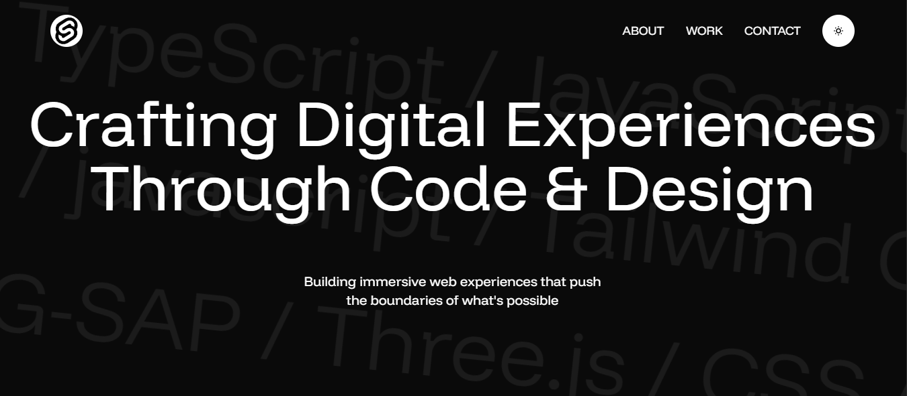
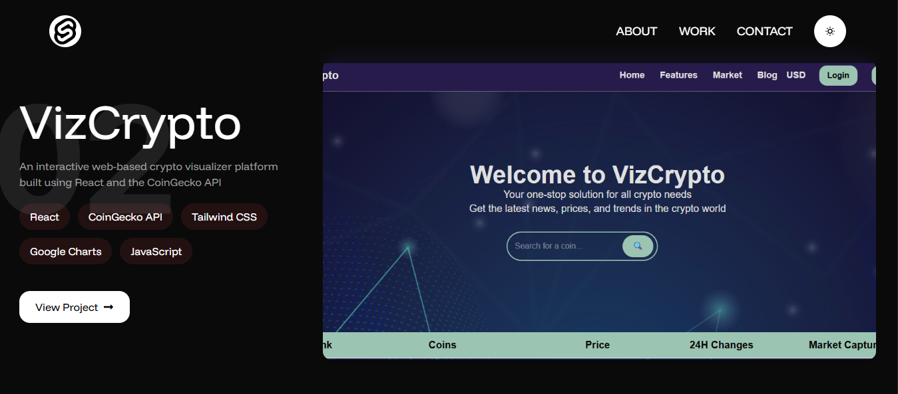

# 🌟 Portfolio Website

A modern, animated developer portfolio built with React, Vite, Tailwind CSS, and GSAP. It features smooth scroll-based animations, a dark/light theme, and a curated selection of projects with live previews and repository links.

---

## ✨ Features

- Smooth, scroll-driven animations with GSAP and ScrollTrigger
- Large, editorial-style project sections
- Dark/light theme support via React Context
- Responsive layout with Tailwind CSS **(not yet working on it)**
- Project cards with hover effects and external links
- Fast builds and local dev via Vite
- Linting with ESLint


---

## 🛠 Tech Stack

- **Vite** – Build tool
- **React.js** – Frontend framework
- **Tailwind CSS** – Styling
- **GSAP** – Animations
- **React Icons** – Iconography
- **EmailJS** – Contact form handling
- **ESLint 9**

---


## 📸 Screenshots

### 🔹 Home Page


### 🔹 Projects Section


___

## 🖥️ Setup & Installation

1. Clone the repo
   ```bash
   git clone https://github.com/your-username/portfolio.git
   ```
2. Install dependencies
    ```bash
    npm install
    ```
3. Start the development server
    ```bash
    npm run dev
    ```
4. Build for production
    ```bash
    npm run build
    ```
5. Preview the production build locally
    ```bash
    npm run preview
    ```
---

## 📬 Contact Me

Email me at:
👉 [Email](emailto:sagarsaini9531@gmail.com)

---